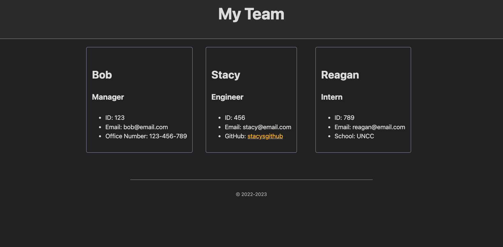

# Challenge 10 - Team Profile Generator

[Walk-through Video](https://drive.google.com/file/d/1vco1YqLgwL5qOcNDNiY9BHOp8-uLmo35/view?usp=sharing)

## Table of Contents
- [Description](#Description)
- [Visuals](#Visuals)

## Description

This application was created to help users create a webpage using their local terminal. By running Node.js and the application's file name, the user is prompted with a series of questions that allows them to input the information of their team members. Once the team member information is inputted, the user is asked if they would like to continue adding new team members. If yes, the program continues. If not, the program generates a HTML file with the provided information embedded in the body of the HTML. Click the link above to see how it works!

## Visuals
